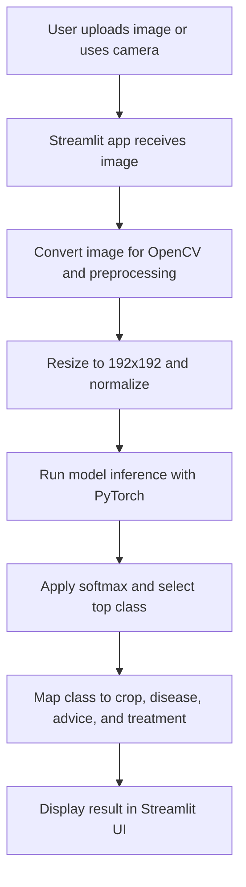

# AgroVision AI

AgroVision AI is a plant disease detection project built with Streamlit, PyTorch, OpenCV, and Albumentations. The application lets a user upload a leaf image or capture one from a camera, runs a trained deep learning model on that image, and returns the predicted crop, disease name, confidence score, and basic care guidance.

This repository is focused on inference and deployment. It contains the Streamlit application, the trained checkpoint, and the utility code needed to preprocess images and generate predictions.

## Problem It Solves

Plant diseases are often identified late because farmers or home growers may not have immediate expert support. AgroVision AI is designed to make first-level screening easier by using a trained image classification model to analyze leaf images and return an instant result.

The goal of the project is not to replace an agronomist or plant pathologist. Instead, it provides a fast initial prediction that can help users decide what to inspect next and whether they should seek expert confirmation.

## Key Features

- Leaf disease prediction from an uploaded image
- Camera-based prediction directly in the Streamlit app
- Confidence score for every prediction
- Automatic crop and disease name formatting for cleaner output
- Basic care guidance and treatment suggestions for supported classes
- Cached model loading for faster repeated use
- Streamlit Community Cloud deployment-ready structure

## How the Project Works

The application follows a simple inference pipeline:

1. The user uploads a leaf image or captures one from the browser camera.
2. The Streamlit app loads the trained model once and keeps it cached.
3. The image is converted into the format required by OpenCV and PyTorch.
4. Albumentations resizes the image to `192 x 192`, normalizes pixel values, and converts it to a tensor.
5. The EfficientNetV2-based classifier predicts the most likely class.
6. Softmax is applied to get class probabilities.
7. The top prediction is mapped to:
   - crop name
   - disease name
   - confidence score
   - guidance text
   - suggested treatment
8. The result is shown in the Streamlit interface.

## Prediction Flow



## Model and Inference Details

- Model family: EfficientNetV2-S
- Model name used in code: `tf_efficientnetv2_s.in21k`
- Framework: PyTorch
- Image preprocessing: Albumentations
- Image handling: OpenCV and Pillow
- Deployment UI: Streamlit

The model checkpoint is loaded from `best_fast_model.pth`. The app reads the `id2label` mapping from the checkpoint so predictions stay aligned with the trained class order.

## Supported Prediction Classes

The current checkpoint supports these classes:

| Crop | Disease / Condition |
| --- | --- |
| Pepper (bell) | Bacterial spot |
| Pepper (bell) | Healthy |
| Potato | Early blight |
| Potato | Late blight |
| Potato | Healthy |
| Tomato | Bacterial spot |
| Tomato | Early blight |
| Tomato | Late blight |
| Tomato | Leaf mold |
| Tomato | Septoria leaf spot |
| Tomato | Spider mites / Two-spotted spider mite |
| Tomato | Target spot |
| Tomato | Tomato yellow leaf curl virus |
| Tomato | Tomato mosaic virus |
| Tomato | Healthy |

## Project Structure

```text
Agrovision-ai/
|-- .streamlit/
|   `-- config.toml
|-- assets/
|-- best_fast_model.pth
|-- DEPLOYMENT.md
|-- LICENSE
|-- packages.txt
|-- README.md
|-- requirements.txt
|-- streamlit_app.py
`-- utils.py
```

## Main Files Explained

- `streamlit_app.py`
  Streamlit user interface. Handles file upload, camera input, model loading, prediction calls, and result display.

- `utils.py`
  Core backend helper logic. Loads the model checkpoint, preprocesses images, runs inference, parses labels, and returns advice data.

- `best_fast_model.pth`
  Trained model checkpoint used for prediction.

- `requirements.txt`
  Python dependencies used for local setup and Streamlit deployment.

- `packages.txt`
  Linux system dependency needed for OpenCV in Streamlit Community Cloud.

- `DEPLOYMENT.md`
  Short deployment-specific guide for Streamlit Community Cloud.

## User Experience Inside the App

When the app starts:

- the model loads once using `st.cache_resource`
- the user chooses either upload mode or camera mode
- the selected image is displayed
- the app runs the model and returns:
  - confidence
  - crop
  - disease
  - care advice
  - suggested treatment

If an image cannot be processed or the model file is missing, the app shows a clear error message instead of crashing.

## Setup and Local Run

### Prerequisites

- Python 3.12 or 3.13 recommended
- Git
- Git LFS for the model file

### Clone the Repository

```bash
git clone https://github.com/MohammedAzam004/Leaf-detection.git
cd Leaf-detection
```

### Pull Large Files

```bash
git lfs install
git lfs pull
```

### Create a Virtual Environment

#### Windows PowerShell

```powershell
python -m venv .venv
.\.venv\Scripts\Activate.ps1
```

### Install Dependencies

```bash
pip install -r requirements.txt
```

### Run the App

```bash
streamlit run streamlit_app.py
```

After that, open the local URL shown in the terminal.

## Deploy on Streamlit Community Cloud

1. Push the latest version of the repository to GitHub.
2. Open [Streamlit Community Cloud](https://share.streamlit.io/).
3. Create a new app.
4. Select this repository and branch.
5. Set the main file path to `streamlit_app.py`.
6. Review Advanced settings if you want to change the Python version.
7. Deploy the app.

Important deployment notes:

- `requirements.txt` must stay in the repository root.
- `packages.txt` must stay in the repository root.
- `best_fast_model.pth` must be available in the repository and correctly uploaded through Git LFS.
- Camera input depends on browser permission support.

## How Advice and Treatment Are Generated

The model predicts a class label first. After that, the app uses an internal mapping in `utils.py` to attach:

- short care advice
- a suggested treatment or pesticide description

These suggestions are intentionally brief. They are useful for first-level guidance, but they should be validated against local agricultural recommendations, regional regulations, and crop-specific conditions.

## Limitations

- The model only supports the classes stored in the current checkpoint.
- The app works best with clear, well-lit leaf images.
- A wrong or low-confidence result is possible if the image is blurry, dark, noisy, or from an unsupported class.
- Treatment suggestions are general guidance, not a substitute for expert agricultural advice.
- This repository does not currently include model training notebooks or retraining scripts.

## Safety and Responsible Use

- Use predictions as an initial screening tool only.
- Confirm severe disease cases with a local agriculture expert, agronomist, or plant clinic.
- Use only locally approved pesticides and follow label instructions.
- Do not rely on the app alone for commercial-scale crop management decisions.

## Future Improvements

Possible next steps for the project:

- add more crops and disease classes
- improve the UI with examples and disease reference images
- add top-k predictions instead of only the top class
- show confidence-based warnings for uncertain results
- support multilingual guidance
- add retraining or fine-tuning scripts to the repository

## Repository Notes

- The model file is tracked with Git LFS.
- The app does not save uploaded images to disk as part of normal prediction flow.
- `runtime.txt` is not required for the current Streamlit Community Cloud setup.

## Author

Developed as the AgroVision AI project for plant health screening and Streamlit-based deployment.
